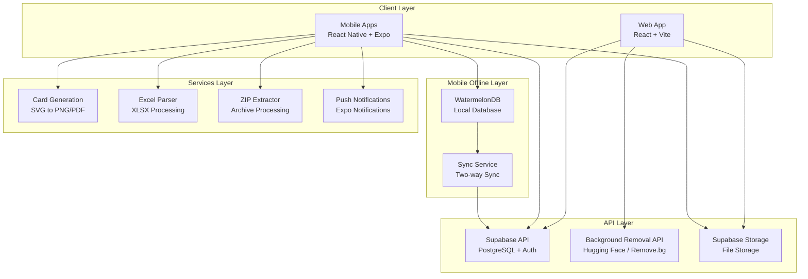

# Design Document

## Overview

This design addresses critical production readiness gaps in the UniCard Solutions platform. The system requires implementation of placeholder features, initialization of offline capabilities, and production-grade quality improvements. This design provides a comprehensive technical approach to achieve true 100% completion and production readiness.

### Design Goals
1. Implement all placeholder features with production-ready code
2. Initialize and test offline database functionality
3. Ensure code quality meets production standards
4. Provide robust error handling and monitoring
5. Optimize performance for production workloads
6. Maintain backward compatibility with existing features

### Scope
- Web application enhancements (background removal, template builder)
- Mobile application core features (card generation, Excel/ZIP import)
- Offline database initialization and sync
- Production code quality improvements
- Testing and documentation

## Architecture

### High-Level Architecture




### System Context

The UniCard Solutions platform consists of:
- **Web Application**: Template builder, student management, admin panel
- **School Mobile App**: Student management, photo upload, order creation
- **Admin Mobile App**: School verification, order management, analytics
- **Shared Package**: Common utilities, types, and services
- **Backend**: Supabase (PostgreSQL, Auth, Storage, Realtime)

Current state: ~75-80% complete with critical placeholders
Target state: 100% production-ready with all features functional

## Components and Interfaces

### 1. Background Removal Service

**Purpose**: Remove backgrounds from student photos using AI

**Technology Options**:
- **Option A**: Hugging Face Inference API (RMBG-1.4 model)
  - Pros: Free tier available, good quality, no account needed
  - Cons: Rate limits, slower processing
  
- **Option B**: Remove.bg API
  - Pros: Fast, excellent quality, reliable
  - Cons: Paid service, requires API key
  
- **Option C**: Self-hosted Rembg (Python)
  - Pros: No external dependencies, unlimited usage
  - Cons: Requires server setup, maintenance overhead

**Recommended**: Option A (Hugging Face) for MVP, Option B for production scale

**Component Structure**:
```typescript
// unicard-creator-hub/src/services/backgroundRemovalService.ts
interface BackgroundRemovalService {
  removeBackground(imageBlob: Blob): Promise<Blob>;
  checkAvailability(): Promise<boolean>;
  getUsageStats(): Promise<UsageStats>;
}

interface UsageStats {
  requestsToday: number;
  remainingQuota: number;
  resetTime: Date;
}
```

**API Integration**:
```typescript
// Hugging Face Implementation
const response = await fetch(
  'https://api-inference.huggingface.co/models/briaai/RMBG-1.4',
  {
    headers: {
      'Authorization': `Bearer ${process.env.HUGGING_FACE_API_KEY}`,
      'Content-Type': 'application/json',
    },
    method: 'POST',
    body: imageBlob,
  }
);
```

**Error Handling**:
- Timeout after 30 seconds
- Retry once on network error
- Fallback to original image on failure
- Display user-friendly error messages


### 2. Mobile Card Generation Service

**Purpose**: Generate ID cards from templates on mobile devices

**Technology Stack**:
- **SVG to PNG**: `react-native-svg` + `react-native-view-shot`
- **PDF Generation**: `react-native-html-to-pdf` (already in package.json)
- **ZIP Creation**: `react-native-zip-archive`

**Component Architecture**:
```typescript
// unicard-shared/src/services/cardGenerationService.ts
interface CardGenerationService {
  generateCard(template: Template, student: StudentData, options: CardOptions): Promise<string>;
  generateBatch(template: Template, students: StudentData[], options: CardOptions): Promise<string[]>;
  createZip(fileUris: string[], zipName: string): Promise<string>;
  shareCard(fileUri: string, title: string): Promise<void>;
  saveToGallery(fileUri: string): Promise<void>;
}

interface CardOptions {
  format: 'png' | 'pdf';
  quality: number; // 0.1 to 1.0
  dpi: 72 | 150 | 300 | 600;
  includeBleed: boolean;
}
```

**Implementation Approach**:

1. **SVG Rendering**:
   - Use react-native-svg to render template
   - Apply dynamic field replacements
   - Render QR codes using react-native-qrcode-svg

2. **PNG Conversion**:
   - Use ViewShot to capture rendered SVG
   - Apply DPI scaling
   - Save to device file system

3. **PDF Conversion**:
   - Convert SVG to HTML
   - Use react-native-html-to-pdf
   - Apply print-optimized settings

4. **ZIP Creation**:
   - Collect all generated card URIs
   - Use react-native-zip-archive
   - Create compressed archive

**Performance Considerations**:
- Process cards in batches of 10
- Show progress indicator
- Use background thread for processing
- Implement cancellation support


### 3. Excel Import Service

**Purpose**: Parse Excel files and import student data on mobile

**Technology Options**:
- **Option A**: Backend API approach
  - Upload Excel to Supabase Storage
  - Edge Function parses and returns JSON
  - Mobile app processes JSON
  
- **Option B**: Native library approach
  - Use `react-native-xlsx` or similar
  - Parse directly on device
  - No backend dependency

**Recommended**: Option A (Backend API) for reliability and consistency

**Component Structure**:
```typescript
// unicard-shared/src/services/excelImportService.ts
interface ExcelImportService {
  parseExcelFile(fileUri: string): Promise<ExcelData[]>;
  autoMapColumns(headers: string[]): ColumnMapping;
  validateMapping(mapping: ColumnMapping): ValidationResult;
  importStudents(data: ExcelData[], mapping: ColumnMapping, schoolId: string): Promise<ImportResult>;
}

interface ExcelData {
  [column: string]: any;
}

interface ColumnMapping {
  [excelColumn: string]: string; // maps to student field
}

interface ImportResult {
  success: number;
  failed: number;
  errors: ImportError[];
}
```

**Backend Edge Function**:
```typescript
// supabase/functions/parse-excel/index.ts
import { serve } from 'https://deno.land/std@0.168.0/http/server.ts';
import * as XLSX from 'https://cdn.sheetjs.com/xlsx-0.19.3/package/xlsx.mjs';

serve(async (req) => {
  const formData = await req.formData();
  const file = formData.get('file');
  
  const workbook = XLSX.read(await file.arrayBuffer());
  const worksheet = workbook.Sheets[workbook.SheetNames[0]];
  const data = XLSX.utils.sheet_to_json(worksheet);
  
  return new Response(JSON.stringify(data), {
    headers: { 'Content-Type': 'application/json' },
  });
});
```

**Auto-Mapping Logic**:
```typescript
const autoMapColumns = (headers: string[]): ColumnMapping => {
  const mapping: ColumnMapping = {};
  
  headers.forEach(header => {
    const lower = header.toLowerCase();
    if (lower.includes('name') && !lower.includes('father') && !lower.includes('parent')) {
      mapping[header] = 'name';
    } else if (lower.includes('class')) {
      mapping[header] = 'class';
    } else if (lower.includes('section')) {
      mapping[header] = 'section';
    } else if (lower.includes('roll')) {
      mapping[header] = 'roll_number';
    }
    // ... more patterns
  });
  
  return mapping;
};
```


### 4. ZIP Photo Upload Service

**Purpose**: Extract photos from ZIP archives and match to students

**Technology**: `react-native-zip-archive`

**Component Structure**:
```typescript
// unicard-shared/src/services/zipPhotoService.ts
interface ZipPhotoService {
  extractZip(zipUri: string): Promise<PhotoFile[]>;
  matchPhotosToStudents(photos: PhotoFile[], students: Student[]): PhotoMatch[];
  uploadPhotos(matches: PhotoMatch[], schoolId: string): Promise<UploadResult>;
}

interface PhotoFile {
  uri: string;
  name: string;
  size: number;
}

interface PhotoMatch {
  photo: PhotoFile;
  student: Student | null;
  confidence: 'high' | 'medium' | 'low' | 'none';
  matchReason: string;
}

interface UploadResult {
  success: number;
  failed: number;
  errors: UploadError[];
}
```

**Matching Algorithm**:
```typescript
const matchPhotosToStudents = (photos: PhotoFile[], students: Student[]): PhotoMatch[] => {
  return photos.map(photo => {
    // Strategy 1: Match by roll number (highest confidence)
    const rollMatch = photo.name.match(/(\d{3,})/);
    if (rollMatch) {
      const student = students.find(s => s.roll_number === rollMatch[1]);
      if (student) {
        return {
          photo,
          student,
          confidence: 'high',
          matchReason: `Roll number ${rollMatch[1]} found in filename`
        };
      }
    }
    
    // Strategy 2: Match by name (medium confidence)
    const nameMatch = photo.name.match(/[_-]([A-Za-z\s]+)\./);
    if (nameMatch) {
      const name = nameMatch[1].replace(/[_-]/g, ' ').toLowerCase();
      const student = students.find(s => 
        s.name.toLowerCase().includes(name) || 
        name.includes(s.name.toLowerCase())
      );
      if (student) {
        return {
          photo,
          student,
          confidence: 'medium',
          matchReason: `Name similarity with ${student.name}`
        };
      }
    }
    
    // No match found
    return {
      photo,
      student: null,
      confidence: 'none',
      matchReason: 'No matching student found'
    };
  });
};
```

**Upload Strategy**:
- Upload photos in batches of 5
- Show progress indicator
- Retry failed uploads
- Update student records with photo URLs


### 5. WatermelonDB Initialization

**Purpose**: Initialize offline database for mobile apps

**Database Structure**:
```typescript
// unicard-shared/src/database/schema.ts (already exists, needs implementation)
import { appSchema, tableSchema } from '@nozbe/watermelondb';

export const schema = appSchema({
  version: 1,
  tables: [
    tableSchema({
      name: 'students',
      columns: [
        { name: 'name', type: 'string' },
        { name: 'roll_number', type: 'string', isIndexed: true },
        { name: 'class', type: 'string' },
        { name: 'section', type: 'string' },
        { name: 'photo_url', type: 'string', isOptional: true },
        { name: 'school_id', type: 'string', isIndexed: true },
        { name: 'synced_at', type: 'number', isOptional: true },
        { name: 'sync_status', type: 'string' }, // 'synced' | 'pending' | 'error'
        { name: 'created_at', type: 'number' },
        { name: 'updated_at', type: 'number' },
      ]
    }),
    tableSchema({
      name: 'orders',
      columns: [
        { name: 'school_id', type: 'string', isIndexed: true },
        { name: 'template_id', type: 'string' },
        { name: 'status', type: 'string' },
        { name: 'student_count', type: 'number' },
        { name: 'synced_at', type: 'number', isOptional: true },
        { name: 'sync_status', type: 'string' },
        { name: 'created_at', type: 'number' },
        { name: 'updated_at', type: 'number' },
      ]
    }),
    tableSchema({
      name: 'sync_queue',
      columns: [
        { name: 'table_name', type: 'string' },
        { name: 'record_id', type: 'string' },
        { name: 'operation', type: 'string' }, // 'create' | 'update' | 'delete'
        { name: 'data', type: 'string' }, // JSON string
        { name: 'retry_count', type: 'number' },
        { name: 'max_retries', type: 'number' },
        { name: 'priority', type: 'number' },
        { name: 'error_message', type: 'string', isOptional: true },
        { name: 'created_at', type: 'number' },
        { name: 'last_retry_at', type: 'number', isOptional: true },
      ]
    }),
    // ... more tables
  ]
});
```

**Model Classes**:
```typescript
// unicard-school-app/src/database/models/Student.ts
import { Model } from '@nozbe/watermelondb';
import { field, date, readonly } from '@nozbe/watermelondb/decorators';

export class Student extends Model {
  static table = 'students';
  
  @field('name') name!: string;
  @field('roll_number') rollNumber!: string;
  @field('class') class!: string;
  @field('section') section!: string;
  @field('photo_url') photoUrl?: string;
  @field('school_id') schoolId!: string;
  @field('sync_status') syncStatus!: string;
  @date('synced_at') syncedAt?: Date;
  @readonly @date('created_at') createdAt!: Date;
  @readonly @date('updated_at') updatedAt!: Date;
}
```

**Database Initialization**:
```typescript
// unicard-school-app/src/database/index.ts
import { Database } from '@nozbe/watermelondb';
import SQLiteAdapter from '@nozbe/watermelondb/adapters/sqlite';
import { schema } from 'unicard-shared/src/database/schema';
import { Student } from './models/Student';
import { Order } from './models/Order';
import { SyncQueue } from './models/SyncQueue';

const adapter = new SQLiteAdapter({
  schema,
  dbName: 'unicard_school',
  jsi: true, // Use JSI for better performance
  onSetUpError: error => {
    console.error('Database setup error:', error);
  }
});

export const database = new Database({
  adapter,
  modelClasses: [Student, Order, SyncQueue],
});
```


### 6. Sync Service Implementation

**Purpose**: Synchronize offline changes with Supabase

**Sync Strategy**: "Push then Pull"
1. Push local changes to server
2. Pull server changes to local
3. Resolve conflicts (server wins)

**Component Integration**:
```typescript
// unicard-school-app/App.tsx
import { database } from './src/database';
import { SyncService } from 'unicard-shared/src/database/sync';

const syncService = new SyncService(database);

// Listen to sync events
syncService.on('syncStart', () => {
  console.log('Sync started');
});

syncService.on('syncComplete', ({ lastSyncAt }) => {
  console.log('Sync completed at', new Date(lastSyncAt));
});

syncService.on('syncError', (error) => {
  console.error('Sync error:', error);
});

// Manual sync trigger
const handleRefresh = async () => {
  await syncService.sync({ force: true });
};
```

**Conflict Resolution**:
```typescript
// Server wins strategy
const resolveConflict = async (localRecord: any, serverRecord: any) => {
  // Compare timestamps
  if (serverRecord.updated_at > localRecord.updated_at) {
    // Server is newer, update local
    await localRecord.update(record => {
      Object.assign(record, serverRecord);
      record.syncStatus = 'synced';
      record.syncedAt = Date.now();
    });
  } else {
    // Local is newer, add to sync queue
    await syncService.addToSyncQueue(
      localRecord._table.name,
      localRecord.id,
      'update',
      localRecord._raw,
      1
    );
  }
};
```

**Network Monitoring**:
```typescript
import NetInfo from '@react-native-community/netinfo';

NetInfo.addEventListener(state => {
  if (state.isConnected) {
    syncService.sync();
  }
});
```


### 7. Template Builder Advanced Functions

**Purpose**: Implement alignment, distribution, and layering functions

**Component Structure**:
```typescript
// unicard-creator-hub/src/components/templateBuilder/ElementManipulation.ts
interface ElementManipulation {
  alignElements(elements: Element[], alignment: AlignmentType): void;
  distributeElements(elements: Element[], direction: 'horizontal' | 'vertical'): void;
  groupElements(elements: Element[]): Group;
  ungroupElements(group: Group): Element[];
  bringToFront(element: Element): void;
  sendToBack(element: Element): void;
  bringForward(element: Element): void;
  sendBackward(element: Element): void;
}

type AlignmentType = 'left' | 'center' | 'right' | 'top' | 'middle' | 'bottom';
```

**Alignment Implementation**:
```typescript
const alignElements = (elements: Element[], alignment: AlignmentType) => {
  if (elements.length < 2) return;
  
  const bounds = getGroupBounds(elements);
  
  elements.forEach(element => {
    switch (alignment) {
      case 'left':
        element.x = bounds.left;
        break;
      case 'center':
        element.x = bounds.left + (bounds.width - element.width) / 2;
        break;
      case 'right':
        element.x = bounds.right - element.width;
        break;
      case 'top':
        element.y = bounds.top;
        break;
      case 'middle':
        element.y = bounds.top + (bounds.height - element.height) / 2;
        break;
      case 'bottom':
        element.y = bounds.bottom - element.height;
        break;
    }
  });
};
```

**Distribution Implementation**:
```typescript
const distributeElements = (elements: Element[], direction: 'horizontal' | 'vertical') => {
  if (elements.length < 3) return;
  
  const sorted = [...elements].sort((a, b) => 
    direction === 'horizontal' ? a.x - b.x : a.y - b.y
  );
  
  const first = sorted[0];
  const last = sorted[sorted.length - 1];
  
  const totalSpace = direction === 'horizontal'
    ? (last.x - first.x - first.width)
    : (last.y - first.y - first.height);
  
  const spacing = totalSpace / (sorted.length - 1);
  
  sorted.forEach((element, index) => {
    if (index === 0 || index === sorted.length - 1) return;
    
    if (direction === 'horizontal') {
      element.x = first.x + first.width + (spacing * index);
    } else {
      element.y = first.y + first.height + (spacing * index);
    }
  });
};
```

**Layering Implementation**:
```typescript
const bringToFront = (element: Element, allElements: Element[]) => {
  const maxZIndex = Math.max(...allElements.map(e => e.zIndex || 0));
  element.zIndex = maxZIndex + 1;
};

const sendToBack = (element: Element, allElements: Element[]) => {
  const minZIndex = Math.min(...allElements.map(e => e.zIndex || 0));
  element.zIndex = minZIndex - 1;
};

const bringForward = (element: Element) => {
  element.zIndex = (element.zIndex || 0) + 1;
};

const sendBackward = (element: Element) => {
  element.zIndex = (element.zIndex || 0) - 1;
};
```


### 8. Production Logging and Monitoring

**Purpose**: Replace console.log with structured logging

**Technology**: Sentry for error tracking and logging

**Setup**:
```typescript
// unicard-creator-hub/src/lib/logger.ts
import * as Sentry from '@sentry/react';

Sentry.init({
  dsn: process.env.VITE_SENTRY_DSN,
  environment: process.env.VITE_APP_ENV || 'development',
  tracesSampleRate: 1.0,
  beforeSend(event) {
    // Don't send events in development
    if (process.env.VITE_APP_ENV === 'development') {
      return null;
    }
    return event;
  },
});

export const logger = {
  info: (message: string, context?: any) => {
    if (process.env.VITE_APP_ENV === 'development') {
      console.log(message, context);
    }
    Sentry.captureMessage(message, {
      level: 'info',
      extra: context,
    });
  },
  
  error: (message: string, error?: Error, context?: any) => {
    if (process.env.VITE_APP_ENV === 'development') {
      console.error(message, error, context);
    }
    Sentry.captureException(error || new Error(message), {
      extra: context,
    });
  },
  
  warn: (message: string, context?: any) => {
    if (process.env.VITE_APP_ENV === 'development') {
      console.warn(message, context);
    }
    Sentry.captureMessage(message, {
      level: 'warning',
      extra: context,
    });
  },
};
```

**Usage**:
```typescript
// Replace console.log
// Before: console.log('Sync started');
// After:
logger.info('Sync started', { userId, timestamp: Date.now() });

// Replace console.error
// Before: console.error('Sync failed:', error);
// After:
logger.error('Sync failed', error, { userId, operation: 'sync' });
```


### 9. Revenue Tracking System

**Purpose**: Track actual payments instead of estimated revenue

**Database Schema**:
```sql
-- supabase/migrations/add_payments_table.sql
CREATE TABLE payments (
  id UUID PRIMARY KEY DEFAULT uuid_generate_v4(),
  order_id UUID REFERENCES orders(id) ON DELETE CASCADE,
  school_id UUID REFERENCES schools(id) ON DELETE CASCADE,
  amount DECIMAL(10, 2) NOT NULL,
  currency VARCHAR(3) DEFAULT 'INR',
  payment_method VARCHAR(50) NOT NULL, -- 'cash', 'online', 'bank_transfer'
  payment_status VARCHAR(20) NOT NULL, -- 'pending', 'completed', 'failed', 'refunded'
  transaction_id VARCHAR(255),
  payment_date TIMESTAMP,
  notes TEXT,
  created_at TIMESTAMP DEFAULT NOW(),
  updated_at TIMESTAMP DEFAULT NOW()
);

CREATE INDEX idx_payments_order_id ON payments(order_id);
CREATE INDEX idx_payments_school_id ON payments(school_id);
CREATE INDEX idx_payments_status ON payments(payment_status);
CREATE INDEX idx_payments_date ON payments(payment_date);

-- RLS Policies
ALTER TABLE payments ENABLE ROW LEVEL SECURITY;

CREATE POLICY "Schools can view own payments" ON payments
  FOR SELECT USING (school_id = auth.uid());

CREATE POLICY "Admins can view all payments" ON payments
  FOR SELECT USING (
    EXISTS (
      SELECT 1 FROM user_roles 
      WHERE user_id = auth.uid() AND role = 'admin'
    )
  );

CREATE POLICY "Admins can insert payments" ON payments
  FOR INSERT WITH CHECK (
    EXISTS (
      SELECT 1 FROM user_roles 
      WHERE user_id = auth.uid() AND role = 'admin'
    )
  );
```

**Component Structure**:
```typescript
// unicard-creator-hub/src/services/paymentService.ts
interface PaymentService {
  recordPayment(payment: PaymentInput): Promise<Payment>;
  getPaymentsByOrder(orderId: string): Promise<Payment[]>;
  getPaymentsBySchool(schoolId: string, dateRange?: DateRange): Promise<Payment[]>;
  getRevenueStats(dateRange?: DateRange): Promise<RevenueStats>;
  exportRevenueReport(dateRange: DateRange, format: 'csv' | 'pdf'): Promise<Blob>;
}

interface PaymentInput {
  orderId: string;
  schoolId: string;
  amount: number;
  paymentMethod: 'cash' | 'online' | 'bank_transfer';
  transactionId?: string;
  paymentDate: Date;
  notes?: string;
}

interface RevenueStats {
  totalRevenue: number;
  revenueByMethod: Record<string, number>;
  revenueBySchool: Array<{ schoolId: string; schoolName: string; revenue: number }>;
  revenueByPeriod: Array<{ date: string; revenue: number }>;
}
```

**Admin Dashboard Integration**:
```typescript
// Replace mock calculation
// Before:
const revenueThisMonth = ordersThisMonth * 50;

// After:
const { data: payments } = await supabase
  .from('payments')
  .select('amount')
  .eq('payment_status', 'completed')
  .gte('payment_date', startOfMonth)
  .lte('payment_date', endOfMonth);

const revenueThisMonth = payments?.reduce((sum, p) => sum + p.amount, 0) || 0;
```


## Data Models

### Student Model (Enhanced)
```typescript
interface Student {
  id: string;
  school_id: string;
  name: string;
  roll_number: string;
  class: string;
  section: string;
  date_of_birth?: string;
  parent_name?: string;
  parent_phone?: string;
  address?: string;
  photo_url?: string;
  photo_original_url?: string; // Before background removal
  photo_processed_url?: string; // After background removal
  created_at: string;
  updated_at: string;
  
  // Offline sync fields
  synced_at?: number;
  sync_status: 'synced' | 'pending' | 'error';
  sync_error?: string;
}
```

### Payment Model (New)
```typescript
interface Payment {
  id: string;
  order_id: string;
  school_id: string;
  amount: number;
  currency: string;
  payment_method: 'cash' | 'online' | 'bank_transfer';
  payment_status: 'pending' | 'completed' | 'failed' | 'refunded';
  transaction_id?: string;
  payment_date?: string;
  notes?: string;
  created_at: string;
  updated_at: string;
}
```

### SyncQueue Model
```typescript
interface SyncQueueItem {
  id: string;
  table_name: string;
  record_id: string;
  operation: 'create' | 'update' | 'delete';
  data: string; // JSON stringified
  retry_count: number;
  max_retries: number;
  priority: number;
  error_message?: string;
  created_at: number;
  last_retry_at?: number;
}
```

## Error Handling

### Error Types
```typescript
enum ErrorType {
  NETWORK_ERROR = 'NETWORK_ERROR',
  AUTHENTICATION_ERROR = 'AUTHENTICATION_ERROR',
  VALIDATION_ERROR = 'VALIDATION_ERROR',
  PERMISSION_ERROR = 'PERMISSION_ERROR',
  NOT_FOUND_ERROR = 'NOT_FOUND_ERROR',
  SERVER_ERROR = 'SERVER_ERROR',
  TIMEOUT_ERROR = 'TIMEOUT_ERROR',
  UNKNOWN_ERROR = 'UNKNOWN_ERROR',
}

class AppError extends Error {
  type: ErrorType;
  userMessage: string;
  technicalMessage: string;
  context?: any;
  
  constructor(
    type: ErrorType,
    userMessage: string,
    technicalMessage: string,
    context?: any
  ) {
    super(technicalMessage);
    this.type = type;
    this.userMessage = userMessage;
    this.technicalMessage = technicalMessage;
    this.context = context;
  }
}
```

### Error Boundary
```typescript
// unicard-creator-hub/src/components/ErrorBoundary.tsx
class ErrorBoundary extends React.Component<Props, State> {
  componentDidCatch(error: Error, errorInfo: React.ErrorInfo) {
    logger.error('React Error Boundary caught error', error, {
      componentStack: errorInfo.componentStack,
    });
  }
  
  render() {
    if (this.state.hasError) {
      return (
        <div className="error-fallback">
          <h2>Something went wrong</h2>
          <p>We've been notified and are working on a fix.</p>
          <Button onClick={() => window.location.reload()}>
            Reload Page
          </Button>
        </div>
      );
    }
    
    return this.props.children;
  }
}
```

### Global Error Handler
```typescript
// unicard-creator-hub/src/lib/errorHandler.ts
export const handleError = (error: unknown, context?: any) => {
  if (error instanceof AppError) {
    // Show user-friendly message
    toast.error(error.userMessage);
    // Log technical details
    logger.error(error.technicalMessage, error, context);
  } else if (error instanceof Error) {
    toast.error('An unexpected error occurred. Please try again.');
    logger.error('Unhandled error', error, context);
  } else {
    toast.error('An unknown error occurred.');
    logger.error('Unknown error type', new Error(String(error)), context);
  }
};
```


## Testing Strategy

### Unit Tests
**Framework**: Jest + React Testing Library

**Coverage Targets**:
- Utility functions: 100%
- Services: 90%
- Components: 80%
- Overall: 80%

**Example Test**:
```typescript
// unicard-shared/src/services/__tests__/cardGenerationService.test.ts
describe('CardGenerationService', () => {
  describe('generateCard', () => {
    it('should generate PNG card with correct dimensions', async () => {
      const template = mockTemplate();
      const student = mockStudent();
      const options = { format: 'png', quality: 0.9, dpi: 300 };
      
      const result = await cardGenerationService.generateCard(
        template,
        student,
        options
      );
      
      expect(result).toBeTruthy();
      expect(result).toMatch(/\.png$/);
    });
    
    it('should throw error for invalid template', async () => {
      const invalidTemplate = { ...mockTemplate(), elements: null };
      
      await expect(
        cardGenerationService.generateCard(invalidTemplate, mockStudent(), {})
      ).rejects.toThrow();
    });
  });
});
```

### Integration Tests
**Framework**: Jest + Supertest (for API) / Detox (for mobile)

**Test Scenarios**:
- Excel upload and parsing
- Photo upload and matching
- Offline sync workflow
- Background removal API integration

**Example Test**:
```typescript
// supabase/functions/__tests__/parse-excel.test.ts
describe('Parse Excel Edge Function', () => {
  it('should parse valid Excel file', async () => {
    const formData = new FormData();
    formData.append('file', excelFileBlob);
    
    const response = await fetch('/parse-excel', {
      method: 'POST',
      body: formData,
    });
    
    expect(response.status).toBe(200);
    const data = await response.json();
    expect(data).toHaveLength(3);
    expect(data[0]).toHaveProperty('Student Name');
  });
});
```

### E2E Tests
**Framework**: Cypress (web) / Detox (mobile)

**Critical User Flows**:
1. School registration and login
2. Add student with photo
3. Create order and generate cards
4. Admin verifies school
5. Offline mode: Add student → Go offline → Sync when online

**Example Test**:
```typescript
// cypress/e2e/student-management.cy.ts
describe('Student Management', () => {
  it('should add student with photo and background removal', () => {
    cy.login('school@example.com', 'password');
    cy.visit('/school/students');
    
    cy.get('[data-testid="add-student-btn"]').click();
    cy.get('[name="name"]').type('John Doe');
    cy.get('[name="roll_number"]').type('001');
    cy.get('[name="class"]').type('10');
    
    cy.get('[data-testid="upload-photo"]').attachFile('student-photo.jpg');
    cy.get('[data-testid="remove-background-btn"]').click();
    cy.get('[data-testid="loading-indicator"]').should('be.visible');
    cy.get('[data-testid="processed-photo"]', { timeout: 30000 }).should('be.visible');
    
    cy.get('[data-testid="save-student-btn"]').click();
    cy.contains('Student added successfully').should('be.visible');
  });
});
```

### Performance Tests
**Framework**: Lighthouse CI (web) / Flashlight (mobile)

**Metrics**:
- First Contentful Paint < 1.5s
- Time to Interactive < 3s
- Largest Contentful Paint < 2.5s
- Cumulative Layout Shift < 0.1
- Mobile app launch time < 2s

